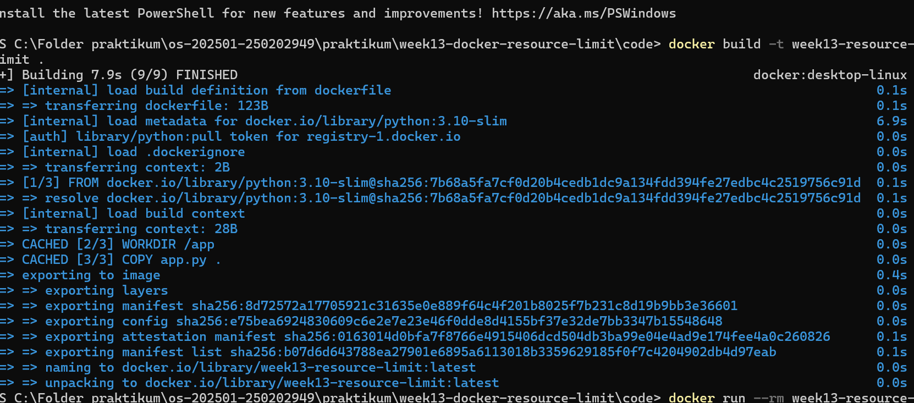
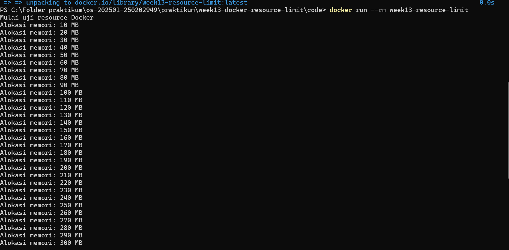
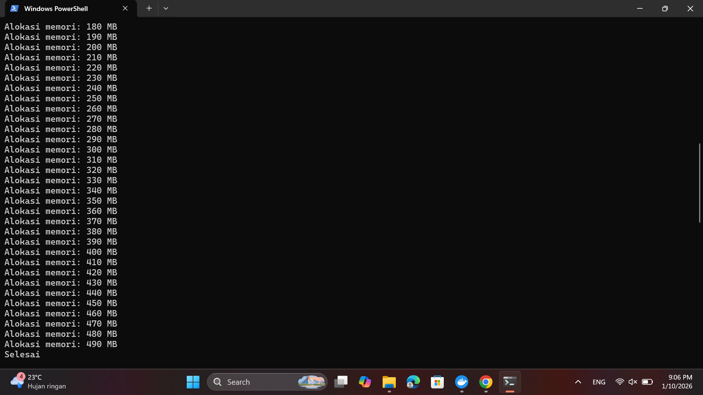
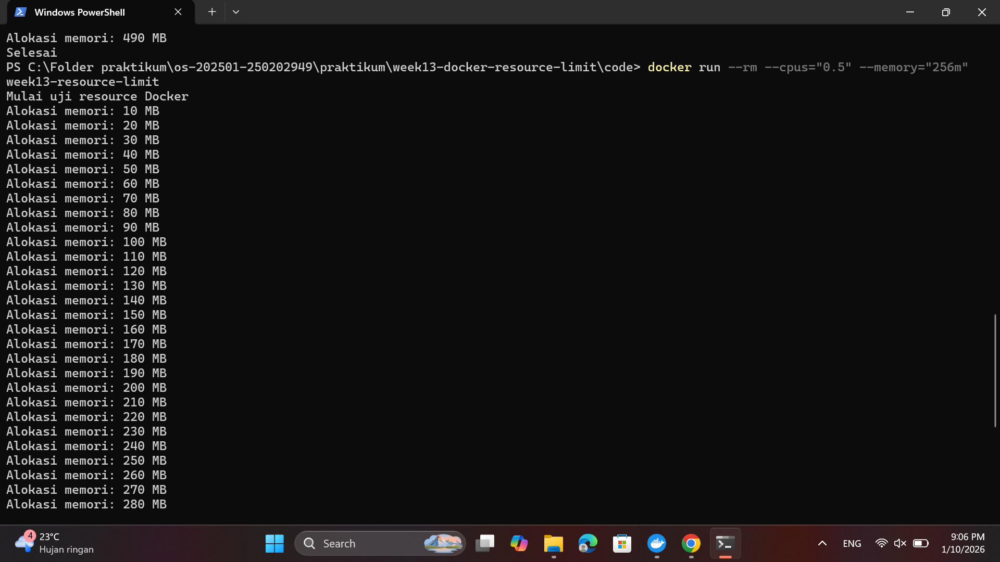
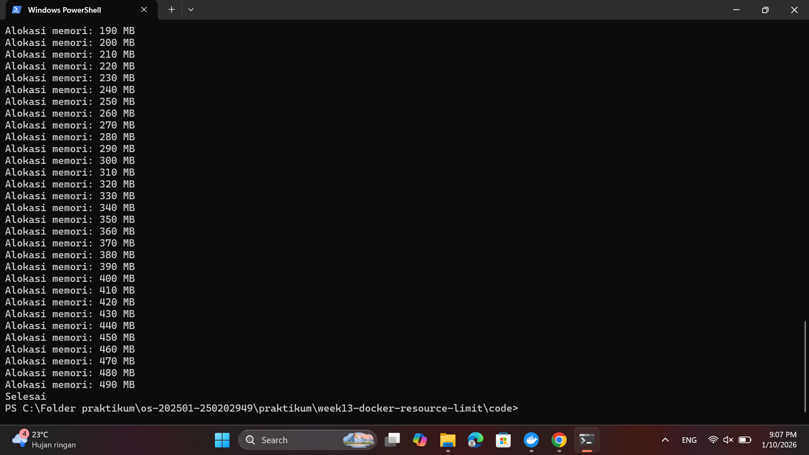

# Laporan Praktikum Minggu 13
Topik: Docker – Resource Limit (CPU & Memori)

---

## Identitas
- **Nama**  : M. Habibi Nur Ramadhan
- **NIM**   : 250202949  
- **Kelas** : 1IKRB

---

## Tujuan
Pada praktikum minggu ini, mahasiswa mempelajari konsep **containerization** menggunakan Docker, serta bagaimana sistem operasi membatasi pemakaian sumber daya proses melalui mekanisme isolasi dan kontrol resource (mis. *cgroups* pada Linux).

Fokus praktikum adalah:
1. Membuat **Dockerfile sederhana** untuk menjalankan aplikasi/skrip.
2. Menjalankan container dengan **pembatasan resource** (CPU dan memori).
3. Mengamati dampak pembatasan resource melalui output program dan monitoring sederhana.

Setelah menyelesaikan tugas ini, mahasiswa mampu:
1. Menulis Dockerfile sederhana untuk sebuah aplikasi/skrip.
2. Membangun image dan menjalankan container.
3. Menjalankan container dengan pembatasan **CPU** dan **memori**.
4. Mengamati dan menjelaskan perbedaan eksekusi container dengan dan tanpa limit resource.
5. Menyusun laporan praktikum secara runtut dan sistematis.

---

## Dasar Teori
**Kontainerisasi (containerization)** adalah proses pengemasan kode aplikasi beserta semua file pustaka, dependensi, dan file konfigurasi yang diperlukan untuk menjalankannya, ke dalam satu paket mandiri yang disebut kontainer. Setiap kontainer membawa dependensi dan konfigurasi sendiri, namun tetap berbagi kernel dengan sistem operasi host. Hal ini membuat kontainer lebih ringan dan memiliki waktu startup yang lebih cepat dibandingkan mesin virtual.

**Pembatasan CPU dan Memori pada Docker** adalah fitur untuk membatasi sumber daya (CPU & RAM) yang bisa digunakan kontainer, mencegah satu kontainer mengambil alih seluruh sumber daya host, menggunakan flag seperti --memory (RAM), --memory-swap, dan --cpus saat menjalankan kontainer, atau melalui Docker Compose/Swarm, dengan tujuan menjamin performa, stabilitas, dan alokasi sumber daya yang adil antar kontainer. 

**Dockerfile** adalah berkas teks yang berisi instruksi untuk membangun sebuah Docker image. Instruksi tersebut mencakup pemilihan base image, penyalinan file aplikasi, pengaturan direktori kerja, serta perintah yang dijalankan saat container dijalankan. Penggunaan Dockerfile memungkinkan proses build image dilakukan secara otomatis dan terstandarisasi.

Daftar Pustaka:
1. Docker Inc. Docker Documentation – Resource Constraints (CPU & Memory).
2. Linux Kernel Organization. Linux Kernel Documentation: Control Groups (cgroups).
3. Silberschatz, A., Galvin, P. B., & Gagne, G. Operating System Concepts. Wiley.
4. Arpaci-Dusseau, R. H., & Arpaci-Dusseau, A. C. Operating Systems: Three Easy Pieces (OSTEP).


---

## Langkah Praktikum dan Ketentuan Teknis
- Sistem operasi host bebas (Windows/macOS/Linux). Disarankan memakai **Docker Desktop** (atau Docker Engine di Linux).
- Program berbasis **terminal**.
- Fokus penilaian pada **keberhasilan build & run container**, **penerapan resource limit**, serta **kualitas analisis**.

Struktur folder (sesuaikan dengan template repo):
```
praktikum/week13-docker-resource-limit/
├─ code/
│  ├─ Dockerfile
│  └─ app.*
├─ screenshots/
│  └─ hasil_limit.png
└─ laporan.md
```
1. **Persiapan Lingkungan**

   - Pastikan Docker terpasang dan berjalan.
   - Verifikasi:
     ```bash
     docker version
     docker ps
     ```

2. **Membuat Aplikasi/Skrip Uji**

   Buat program sederhana di folder `code/` (bahasa bebas) yang:
   - Melakukan komputasi berulang (untuk mengamati limit CPU), dan/atau
   - Mengalokasikan memori bertahap (untuk mengamati limit memori).

3. **Membuat Dockerfile**

   - Tulis `Dockerfile` untuk menjalankan program uji.
   - Build image:
     ```bash
     docker build -t week13-resource-limit .
     ```

4. **Menjalankan Container Tanpa Limit**

   - Jalankan container normal:
     ```bash
     docker run --rm week13-resource-limit
     ```
   - Catat output/hasil pengamatan.

5. **Menjalankan Container Dengan Limit Resource**

   Jalankan container dengan batasan resource (contoh):
   ```bash
   docker run --rm --cpus="0.5" --memory="256m" week13-resource-limit
   ```
   Catat perubahan perilaku program (mis. lebih lambat, error saat memori tidak cukup, dll.).

6. **Monitoring Sederhana**

   - Jalankan container (tanpa `--rm` jika perlu) dan amati penggunaan resource:
     ```bash
     docker stats
     ```
   - Ambil screenshot output eksekusi dan/atau `docker stats`.

7. **Commit & Push**

   ```bash
   git add .
   git commit -m "Minggu 13 - Docker Resource Limit"
   git push origin main
   ```

---


## Kode / Perintah
### Program
```bash
import time

print("Mulai uji resource Docker", flush=True)
data = []

for i in range(1, 50):
    data.append("X" * 10_000_000)  # 10 MB
    print(f"Alokasi memori: {i*10} MB", flush=True)
    time.sleep(0.3)

print("Selesai")
```
### Dockerfile
```bash
ROM python:3.10-slim

WORKDIR /app

COPY app.py .

CMD ["python", "app.py"]
```

### Kode perintah docker

` docker build -t week13-resource-limit .`
`docker run --rm week13-resource-limit`
`docker run --rm --cpus="0.5" --memory="256m" week13-resource-limit`
` docker stats`

---

## Hasil Eksekusi

### 1.Docker build


### 2.Menjalankan Container tanpa limit



### 3.Menjalankan container dengan limit resource



### 4.Monitoring sederhana tanpa --rm


---

## Analisis
* Program yang dijalankan tanpa pembatas sumberdaya, akan terus berjalan tanpa henti dan meningkatkan penggunaan memori, dan akan terus berjalan hingga sumber daya habis.

* Program yang di berikan pembatasan sumber daya akan berjalan hingga batas yang di berikan sudah tercapai. Program berhenti dan tidak lagi melanjutkan eksekusi.

---

## Kesimpulan


* Docker menyediakan mekanisme pembatasan resource yang efektif melalui CPU dan memory limit. Pembatasan ini penting untuk menjaga stabilitas sistem dan efisiensi penggunaan resource.

* Penggunaan fitur resource limit pada Docker membantu pengembang dan administrator sistem dalam melakukan pengujian performa aplikasi sebelum dijalankan pada lingkungan produksi.

* Dengan adanya pembatasan CPU dan memori, penggunaan sumber daya sistem menjadi lebih terkontrol sehingga stabilitas host dan container lain tetap terjaga meskipun terdapat aplikasi yang bersifat intensif terhadap resource.


---

## Quiz
1. Mengapa container perlu dibatasi CPU dan memori?
**Jawaban**: Tujuan container membatasi cpu dan memori untuk menjaga kestabilan sistem, mencegah satu container memonopoli sumber daya (resource hogging). Serta memastikan kinerja aplikasi tetap konsisten hingga mengoptimalisasikan biaya. 
2. Apa perbedaan VM dan container dalam konteks isolasi resource?
**Jawaban**:Perbedaan utamanya dalam konteks isolasi resource terletak pada tingkat (lapisan) tumpukan perangkat lunak tempat isolasi terjadi dan apa yang dibagikan atau tidak dibagikan. keduanya memiliki perbedaan yang cukup jelas, baik itu dari tingkat isolasi, untuk VM mengisolasi seluruh sistem operasi (OS) tamu dari host. sedangkan Container mengisolasi proses aplikasi pada tingkat OS. Container membagikan kernel OS host yang sama, tetapi berjalan dalam lingkungan terisolasi milik mereka sendiri (user space). Kemudian dari segi penggunaan resource VM lebih berat (lebih heavyweight) karena memerlukan hypervisor, sedangkan Container lebih ringan (lebih lightweight) dan jauh lebih efisien dalam penggunaan resource.
3. Apa dampak limit memori terhadap aplikasi yang boros memori?
**Jawaban**: Tentunya memiliki dampak yang signifikan menyebabkan masalah kestabilan kinerja. Ketika aplikasi kehabisan memori bebas, sistem operasi akan mulai menggunakan swap space (memori virtual pada hard drive atau SSD). Intinya limit memori itu berfungsi sebagai jaring pengaman, tetapi aplikasi yang mengabaikannya akan menghadapi konsekuensi serius berupa kinerja yang buruk dan penghentian paksa.

---

## Refleksi Diri
Tuliskan secara singkat:
- Apa bagian yang paling menantang minggu ini?  Belajar mengaplikasikan docker
- Bagaimana cara Anda mengatasinya?  Mempelajari materi ini dengan baik. Kemudian mempraktekkan.

---

**Credit:**  
_Template laporan praktikum Sistem Operasi (SO-202501) – Universitas Putra Bangsa_
