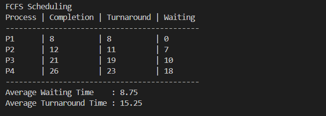
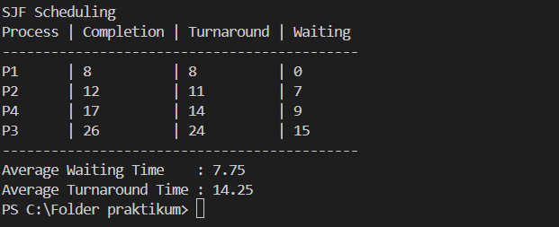

# Laporan Praktikum Minggu 14
Topik: Laporan IMRAD CPU Scheduling 

---

## Identitas
- **Nama**  : M. Habibi Nur Ramadhan
- **NIM**   : 250202949
- **Kelas** : IKRB

---

## Pendahuluan
#### Latar belakang
CPU scheduling merupakan salah satu fungsi utama operating system, ini berfungsi untuk mengatur eksekusi proses agar penggunaan CPU dapat terbagi adil dan efisien. Contoh algoritma yang di kembangkan yaitu FCFS dan SJF tentunya, algoritma ini dibuat untuk mencapai tujuan tersebut.

Algoritma FCFS (First Come First Served) sesuai dengan namanya yang datang terlebih dahulu yang akan di eksekusi, algoritma ini sangat adil dalam hal urutan kedatangan. Algoritma FCFS mengeksekusi proses berdasarkan urutan kedatangan tanpa mempertimbangkan lama waktu eksekusi, sehingga sederhana dalam implementasi namun berpotensi menimbulkan convoy effect [2].

Algoritma SJF (Shortes Job First) artinya proses yg memiliki waktu eksekusi tercepat akan didahulukan, algoritma ini sangat efisien dalam mengeksekusi proses. Algoritma SJF memilih proses dengan waktu eksekusi (burst time) paling singkat, yang secara teoritis dapat meminimalkan rata-rata waktu tunggu (average waiting time) [3].

Perbedaan karakteristik kedua algoritma tersebut mendorong perlunya analisis dan perbandingan kinerja berdasarkan parameter tertentu. Oleh karena itu, praktikum ini dilakukan untuk membandingkan algoritma FCFS dan SJF dengan menggunakan data proses yang diambil dari file CSV, serta mengevaluasi kinerja keduanya berdasarkan nilai waiting time dan turnaround time.

#### Rumusan Masalah
1. Bagaimana mekanisme kerja algoritma CPU Scheduling FCFS dan SJF dalam mengatur eksekusi proses pada sistem operasi?
2. Bagaimana perbandingan kinerja algoritma FCFS dan SJF berdasarkan parameter waiting time dan turnaround time?
3. Algoritma manakah yang memberikan kinerja lebih optimal pada dataset proses yang digunakan dalam praktikum ini?

#### Tujuan
1. Menjelaskan prinsip dan mekanisme penjadwalan proses menggunakan algoritma FCFS dan SJF.
2. Mengimplementasikan algoritma FCFS dan SJF menggunakan data proses yang dibaca dari file CSV.
3. Menganalisis dan membandingkan kinerja kedua algoritma berdasarkan nilai waiting time dan turnaround time untuk menentukan algoritma yang lebih efisien.

---

## Metode
#### Lingkungan Uji
* Windows 10
* Bahasa Pemrograman: Python 3
* Tools: Terminal, Editor teks

#### Langkah Eksperimen
* Menentukan data proses (arrival time dan burst time).
* Menerapkan algoritma FCFS dan SJF (non-preemptive).
* Menghitung waiting time dan turnaround time setiap proses.
* Menghitung rata-rata waiting time dan turnaround time.

#### Dataset / Parameter Uji

| Proses | Arival Time | Burst Time|
|---------|------------|------------|
|P1|0|8|
|P2|1|4|
|P3|2|9|
|P4|3|5|

#### Cara Pengukuran
* Menggunakan Tabel perbandingan berikut :
1. Perbandingan Rata-rata Waktu

|Algoritma|	Avg Waiting Time	|Avg Turnaround Time| Keterangan|
----------|-------------------|-------------------|----|
| FCFS |   0  |    0     | - |
| SJF  |   0  |    0     | - |

---

## Hasil
1. Output Hasil FCFS

2. Output Hasil SJF

Algoritma SJF menghasilkan rata-rata waiting time dan turnaround time yang lebih rendah dibandingkan dengan algoritma FCFS. Hal ini menunjukkan bahwa SJF lebih efisien dalam meminimalkan waktu tunggu proses, khususnya ketika terdapat variasi burst time yang signifikan.

---

## Pembahasan
#### Interpresi Hasil, keterbatasan, dan perbandingan teori/ekspektasi.
Bisa kita lihat perbandingan pada tabel ini.

|Algoritma|	Avg Waiting Time	|Avg Turnaround Time| Keterangan|
----------|-------------------|-------------------|----|
| FCFS |   8,75 |    15,25     | Memiliki waktu rata-rata yang cukup tinggi |
| SJF  |   7,75  |   14,25    | Memiliki waktu rata-rata lebih rendah  |

Berdasarkan hasil atau output program yang di peroleh kita bisa simpulkan bahwa algoritma SJF menunjukan kinerja yang lebih baik dari algoritma FCFS tentunya dalam hal waiting time dan turnarround time. Hal ini sesuai dengan teori penjadwalan CPU yang menyatakan bahwa SJF mampu meminimalkan waktu tunggu rata-rata dengan memprioritaskan proses yang memiliki burst time lebih pendek [3].

Pada algoritma FCFS, proses dieksekusi berdasarkan urutan kedatangan tanpa mempertimbangkan lama waktu eksekusi. Kondisi ini dapat menyebabkan terjadinya convoy effect, jika proses yang memiliki waktu eksekusi lama di eksekusi, maka proses kecil lainnya menunggu hingga proses besar selesai. Fenomena ini terlihat pada hasil praktikum, di mana nilai waiting time pada FCFS relatif lebih besar dibandingkan SJF [2].

Meskipun algoritma SJF terbilang cukup unggul akan tetapi, memiliki keterbatasan dalam penerapan nyata karena, membutuhkan informasi atau estimasi burst time setiap proses sebelum dieksekusi. Disisi lain algpritma FCFS juga tidak begitu buruk dalam hal kesederhanaan implementasi dan keadilan berdasarkan proses urutan kedatangan.

Keterbatasan pada praktikum ini adalah penggunaan dataset proses yang relatif sederhana dan penerapan algoritma dalam bentuk non-preemptive. Oleh karena itu, hasil yang diperoleh belum sepenuhnya merepresentasikan kondisi sistem operasi nyata yang bersifat dinamis.

---

## Daftar Pustaka

1. Silberschatz, A., Galvin, P., Gagne, G. Operating System Concepts, 10th Edition.
2. Tanenbaum, A. Modern Operating Systems, 4th Edition.
3. Arpaci-Dusseau, R. H., Arpaci-Dusseau, A. C. Operating Systems: Three Easy Pieces (OSTEP)

---

## Quiz
1. Mengapa format IMRAD membantu membuat laporan praktikum lebih ilmiah dan mudah dievaluasi?
Jawaban :

 Format IMRAD memungkinkan laporan praktikum akan lebih ilmiah dan mudah di evaluasi karena mengikuti alur dalam berfikir logis dari metode ilmiah, isi nya terstruktur secara standar, serta fokus utamanya memaparkan data secara transparan.

2. Apa perbedaan antara bagian **Hasil** dan **Pembahasan**?
Jawaban :

 Pada bagian hasil memaparkan hasil praktikum yang kita lakukan , contoh nya seperti output program yang saya buat , memaparkan hasil perhitungan algoritma penjadwalan, sedangkan pada bagian pembahasan berisi tentang penjelasan yang lebih spesifik mengenai program yang di buat seperti kelemahan, kekurangan, memaparkan ulang hal yang sedang di bahas, hingga membandingkan mengenai kebenaran teori yang di praktikkan.

3. Mengapa sitasi dan daftar pustaka penting, bahkan untuk laporan praktikum?
Jawaban :

Untuk mengetahui sumber dari mana teori itu dan sumber ilmiah yang jelas, agar laporan yang kita buat itu bisa dipertanggungjawabkan kebenaran isinya, tidak di buat atas opini dan pendapat pribadi yang belum dibuktikan kebenarannya secara ilmiah. Selain itu sitasi juga berfungsi agar kita tidak terkena plagiarisme dan menghargai penulis atau sumber asli yang digunakan.

---

## Kesimpulan
1. Berdasarkan hasil praktikum, algoritma SJF menghasilkan **rata-rata waiting time** dan **turnaround time** yang lebih kecil dibandingkan dengan algoritma FCFS.
2. Algoritma **FCFS** memiliki keunggulan dalam hal kesederhanaan dan kemudahan implementasi, namun kurang baik dari sisi kinerja karena berpotensi menimbulkan *convoy effect*.
3. Algoritma **SJF** lebih efisien dalam mengoptimalkan kinerja CPU, tetapi membutuhkan estimasi burst time yang akurat sehingga penerapannya pada sistem nyata memiliki keterbatasan.
4. Pemilihan algoritma CPU Scheduling perlu mempertimbangkan keseimbangan antara **efisiensi kinerja**, **kompleksitas implementasi**, dan **karakteristik beban kerja sistem**.

---

## Refleksi Diri
Tuliskan secara singkat:
- Apa bagian yang paling menantang minggu ini?  Membuat laporan
- Bagaimana cara Anda mengatasinya?  Tetap mengisi tekad, agar bisa menyelesaikan laporan ini.

---

**Credit:**  
_Template laporan praktikum Sistem Operasi (SO-202501) – Universitas Putra Bangsa_
